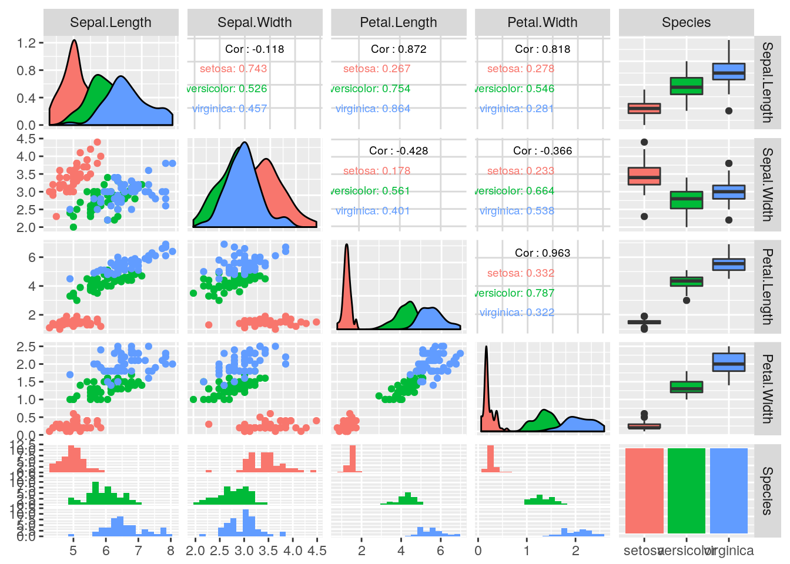

# はじめに


```r
library(mlr)
 ## Loading required package: ParamHelpers
```


細かいところは飛ばしていきます。

## 必要なライブラリとツール

- **mlr**
    - Rで機械学習と言えばこれという説がある。
    - チュートリアルを訳したもの: [mlrパッケージチュートリアル - Quick Walkthrough編](https://nozma.github.io/mlr_tutorial/)
- **ggplot2**
    - プロット用パッケージ。
- **GGally**
    - ggplot2を使って散布図行列等が簡単に作成できるパッケージ。
- **reticulate**
    - RからPython使うやつ。

## 最初のアプリケーション: アイリスのクラス分類

- **みんな大好きiris**
- Rでは最初からirisを使える。


```r
head(iris)
 ##   Sepal.Length Sepal.Width Petal.Length Petal.Width Species
 ## 1          5.1         3.5          1.4         0.2  setosa
 ## 2          4.9         3.0          1.4         0.2  setosa
 ## 3          4.7         3.2          1.3         0.2  setosa
 ## 4          4.6         3.1          1.5         0.2  setosa
 ## 5          5.0         3.6          1.4         0.2  setosa
 ## 6          5.4         3.9          1.7         0.4  setosa
```

- **iris**をヘルプに渡せばデータの解説も得られる。
- `?iris`でも良い。

```r
help(iris)
```


```
 ## _E_d_g_a_r _A_n_d_e_r_s_o_n'_s _I_r_i_s _D_a_t_a
 ## 
 ## _D_e_s_c_r_i_p_t_i_o_n:
 ## 
 ##      This famous (Fisher's or Anderson's) iris data set gives the
 ##      measurements in centimeters of the variables sepal length and
 ##      width and petal length and width, respectively, for 50 flowers
 ##      from each of 3 species of iris.  The species are _Iris setosa_,
 ##      _versicolor_, and _virginica_.
 ## 
 ## _U_s_a_g_e:
 ## 
 ##      iris
 ##      iris3
 ##      
 ## _F_o_r_m_a_t:
 ## 
 ##      'iris' is a data frame with 150 cases (rows) and 5 variables
 ##      (columns) named 'Sepal.Length', 'Sepal.Width', 'Petal.Length',
 ##      'Petal.Width', and 'Species'.
 ## 
 ##      'iris3' gives the same data arranged as a 3-dimensional array of
 ##      size 50 by 4 by 3, as represented by S-PLUS.  The first dimension
 ##      gives the case number within the species subsample, the second the
 ##      measurements with names 'Sepal L.', 'Sepal W.', 'Petal L.', and
 ##      'Petal W.', and the third the species.
 ## 
 ## _S_o_u_r_c_e:
 ## 
 ##      Fisher, R. A. (1936) The use of multiple measurements in taxonomic
 ##      problems.  _Annals of Eugenics_, *7*, Part II, 179-188.
 ## 
 ##      The data were collected by Anderson, Edgar (1935).  The irises of
 ##      the Gaspe Peninsula, _Bulletin of the American Iris Society_,
 ##      *59*, 2-5.
 ## 
 ## _R_e_f_e_r_e_n_c_e_s:
 ## 
 ##      Becker, R. A., Chambers, J. M. and Wilks, A. R. (1988) _The New S
 ##      Language_.  Wadsworth & Brooks/Cole. (has 'iris3' as 'iris'.)
 ## 
 ## _S_e_e _A_l_s_o:
 ## 
 ##      'matplot' some examples of which use 'iris'.
 ## 
 ## _E_x_a_m_p_l_e_s:
 ## 
 ##      dni3 <- dimnames(iris3)
 ##      ii <- data.frame(matrix(aperm(iris3, c(1,3,2)), ncol = 4,
 ##                              dimnames = list(NULL, sub(" L.",".Length",
 ##                                              sub(" W.",".Width", dni3[[2]])))),
 ##          Species = gl(3, 50, labels = sub("S", "s", sub("V", "v", dni3[[3]]))))
 ##      all.equal(ii, iris) # TRUE
 ## 
```

### 最初にすべきこと: データをよく観察する

訓練セットとテストセットに分割してからプロットする必要も無いと思うので、先に散布図行列を作成する。ここでは**ggplot2**を使って散布図行列を作成する**GGally**パッケージを使用した。


```r
GGally::ggpairs(
  iris, ggplot2::aes(color = Species),
  upper = list(continuous = GGally::wrap("cor", size = 2.5)),
  lower = list(combo = GGally::wrap("facethist", bins = 20))
)
```




### 成功度合いの測定: 訓練データとテストデータ

- 雑な感じで3:1にデータを分割する。


```r
n <- nrow(iris)
iris_train <- sample(n, size = 3/4 * n)
iris_test <- setdiff(1:n, iris_train)
```

### 最初のモデル: $k$-最近傍法

- sklearnよろしく、まず学習器のインスタンスを生成する。
- $k$=1のkNNからということなので、そのようにする。


```r
lrn <- makeLearner(
  "classif.knn", k = 1
)
lrn
 ## Learner classif.knn from package class
 ## Type: classif
 ## Name: k-Nearest Neighbor; Short name: knn
 ## Class: classif.knn
 ## Properties: twoclass,multiclass,numerics
 ## Predict-Type: response
 ## Hyperparameters: k=1
```

学習器を作成したらデータをフィットさせて訓練する。


```r
## まずタスクを作成する必要がある
iris_task <- makeClassifTask(data = iris, target = "Species")
## 訓練する
mod <- train(lrn, iris_task, subset = iris_train)
mod
 ## Model for learner.id=classif.knn; learner.class=classif.knn
 ## Trained on: task.id = iris; obs = 112; features = 4
 ## Hyperparameters: k=1
```

### 予測を行う

予測は`predict`で行う。


```r
predict(mod, newdata = data.frame(5, 2.9, 1, 0.2))
 ## Prediction: 1 observations
 ## predict.type: response
 ## threshold: 
 ## time: 0.00
 ##   response
 ## 1   setosa
```

setosaと予測されたがこれが正しい分類かどうかわからない…。この時のためにテストデータをとっておいたのだった。

### モデルの評価

- テストデータを使った予測結果とテストデータの真のクラスラベルを比較する。
- テストデータのうち正しく分類できたものの割合を**精度**と呼ぶ。

mlrでは`predict`にタスクとsubsetを指定すると、subsetに対して指定したインデックスで予測を行い、予測されたクラスラベルと正解のクラスラベルを合わせて返してくれる。


```r
pred <- predict(mod, task = iris_task, subset = iris_test)
pred
 ## Prediction: 38 observations
 ## predict.type: response
 ## threshold: 
 ## time: 0.00
 ##    id  truth response
 ## 2   2 setosa   setosa
 ## 4   4 setosa   setosa
 ## 10 10 setosa   setosa
 ## 13 13 setosa   setosa
 ## 19 19 setosa   setosa
 ## 21 21 setosa   setosa
 ## ... (#rows: 38, #cols: 3)
```

従って、精度を求めるにはtruthとresponseの値の一致率を見ればよい。


```r
mean(pred$data$truth == pred$data$response)
 ## [1] 0.9473684
```

無論、性能指標を計算するための関数も用意されている。予測結果を`performance`に渡せば良い。


```r
performance(pred, measures = list(mmce, acc)) # 計算する指標を指定している
 ##       mmce        acc 
 ## 0.05263158 0.94736842
```

