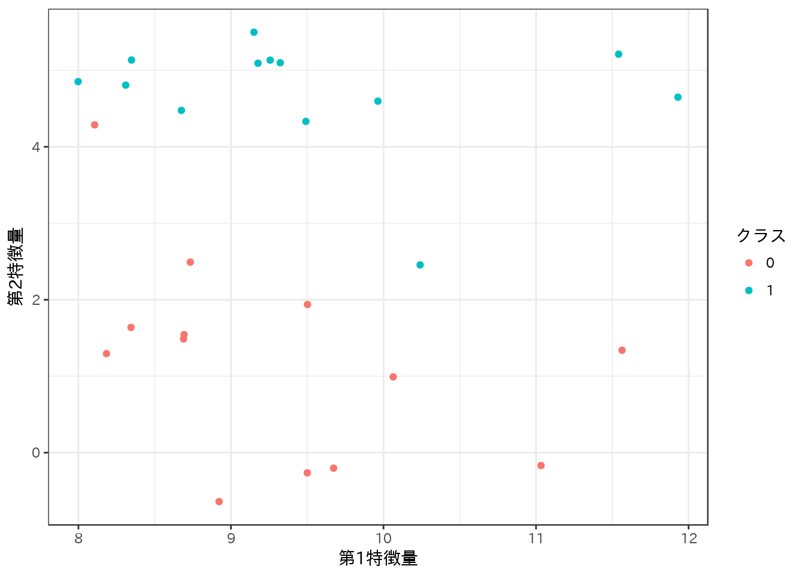
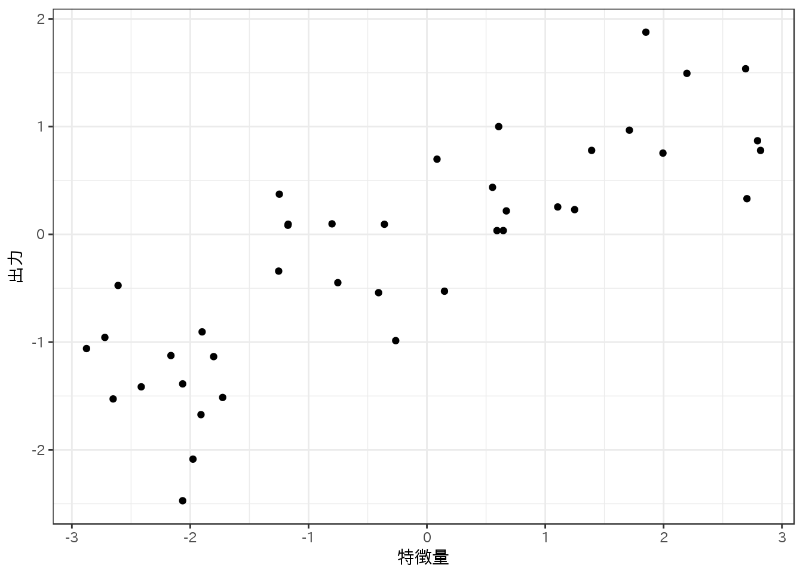

# 教師あり学習 (1)


長くなりそうなので分割。おそらく決定木あたりまで。


```r
library(mlr)
 ## Loading required package: ParamHelpers
library(reticulate) # pythonモジュールからデータだけいただく用
use_python("/usr/bin/python3")
library(ggplot2)
library(dplyr)
 ## 
 ## Attaching package: 'dplyr'
 ## The following objects are masked from 'package:stats':
 ## 
 ##     filter, lag
 ## The following objects are masked from 'package:base':
 ## 
 ##     intersect, setdiff, setequal, union
library(magrittr)
theme_set(theme_bw(base_family = "IPAexGothic")) # ggplot2の日本語プロット用
library(mlbench)
library(mlrCPO)
```

## 教師あり機械学習アルゴリズム

### サンプルデータセット

#### 人工的なデータセット

書籍の方では**mgleran**モジュールを使ってデータを生成しているので、**reticulate**をデータだけ取得する。

まずは2クラス分類向けの**forge**を取得し、プロットする。


```r
mglearn <- import("mglearn")
forge <- mglearn$datasets$make_forge()
forge %<>% as.data.frame()
names(forge)[3] <- "y"
ggplot(forge, aes(x = X1, y = X2, color = factor(y))) + 
  scale_color_discrete(name = "クラス") +
  labs(x = "第1特徴量", y = "第2特徴量") +
  geom_point()
```



次に回帰向けのデータセット**wave**を取得し、プロットする。


```r
wave <- mglearn$datasets$make_wave(n_samples = 40L)
wave %<>% as.data.frame()
names(wave) <- c("X", "y")
ggplot(wave, aes(X, y)) +
  geom_point() +
  labs(x = "特徴量", y = "出力")
```



#### 実世界のデータセット

**breast cancer**も**boston housing**も**mlbench**パッケージに含まれているが、**breast cancer**の方は**sklearn**に入っているものと若干異なる。**breast cancer**にはOriginalとDiagnosticの2種類あるらしい。**sklearn**に入っているのはDiagnosticで、**mlbench**のやつはOriginal。

- [UCI Machine Learning Repository: Breast Cancer Wisconsin (Original) Data Set](https://archive.ics.uci.edu/ml/datasets/breast+cancer+wisconsin+(original))
- [UCI Machine Learning Repository: Breast Cancer Wisconsin (Diagnostic) Data Set](https://archive.ics.uci.edu/ml/datasets/Breast+Cancer+Wisconsin+(Diagnostic))

Diagnosticの方は少し探したけどRの中には見つからなかったので(代わりにOriginalが`MASS::biopsy`にもあるのを見つけた)、**sklearn**から読み込んで細工しておく。


```r
sklearn <- import("sklearn")
cancer = sklearn$datasets$load_breast_cancer()
cancer_data <- as.data.frame(cancer$data)  # データフレーム化
names(cancer_data) <- cancer$feature_names # 特徴量名取り込み
cancer_data$Class <- cancer$target_names[cancer$target+1] # クラス取り込み
```
- **breast cancer**は569のデータポイントと30の特徴量を持つ。


```r
dim(cancer_data) # クラスも含めているので列数は1多い
 ## [1] 569  31
```

各クラスの集計をする。


```r
table(cancer_data$Class)
 ## 
 ##    benign malignant 
 ##       357       212
```

**boston housing**は**mlbench**パッケージ内のものと**sklearn**のものは同じなので、そのまま使用できる。


```r
data("BostonHousing")
head(BostonHousing)
 ##      crim zn indus chas   nox    rm  age    dis rad tax ptratio      b
 ## 1 0.00632 18  2.31    0 0.538 6.575 65.2 4.0900   1 296    15.3 396.90
 ## 2 0.02731  0  7.07    0 0.469 6.421 78.9 4.9671   2 242    17.8 396.90
 ## 3 0.02729  0  7.07    0 0.469 7.185 61.1 4.9671   2 242    17.8 392.83
 ## 4 0.03237  0  2.18    0 0.458 6.998 45.8 6.0622   3 222    18.7 394.63
 ## 5 0.06905  0  2.18    0 0.458 7.147 54.2 6.0622   3 222    18.7 396.90
 ## 6 0.02985  0  2.18    0 0.458 6.430 58.7 6.0622   3 222    18.7 394.12
 ##   lstat medv
 ## 1  4.98 24.0
 ## 2  9.14 21.6
 ## 3  4.03 34.7
 ## 4  2.94 33.4
 ## 5  5.33 36.2
 ## 6  5.21 28.7
```

次に、特徴量同士の積を重複ありで選択して拡張する、という作業が出て来る。書籍の方ではmglearnの影に隠れてしまっているが、これは`sklearn.preprocessing.PolynomialFeatures`という関数の機能によっている。

これに近いことは、**mlrCPO**パッケージの`cpoModelMatrix`関数を使うと実行できる。**mlrCPO**パッケージはまだCRANには無いので、`devtools::install_github("mlr-org/mlrCPO")`のようにgithubからインストールする必要がある。


```r
boston_task <- makeRegrTask(data = BostonHousing, target = "medv")
boston_task_ex <- boston_task %>>% cpoModelMatrix(~ 0 + .^2)
boston_task_ex
 ## Supervised task: BostonHousing
 ## Type: regr
 ## Target: medv
 ## Observations: 506
 ## Features:
 ##    numerics     factors     ordered functionals 
 ##          92           0           0           0 
 ## Missings: FALSE
 ## Has weights: FALSE
 ## Has blocking: FALSE
 ## Has coordinates: FALSE
getTaskFeatureNames(boston_task_ex)
 ##  [1] "crim"          "zn"            "indus"         "chas0"        
 ##  [5] "chas1"         "nox"           "rm"            "age"          
 ##  [9] "dis"           "rad"           "tax"           "ptratio"      
 ## [13] "b"             "lstat"         "crim:zn"       "crim:indus"   
 ## [17] "crim:chas1"    "crim:nox"      "crim:rm"       "crim:age"     
 ## [21] "crim:dis"      "crim:rad"      "crim:tax"      "crim:ptratio" 
 ## [25] "crim:b"        "crim:lstat"    "zn:indus"      "zn:chas1"     
 ## [29] "zn:nox"        "zn:rm"         "zn:age"        "zn:dis"       
 ## [33] "zn:rad"        "zn:tax"        "zn:ptratio"    "zn:b"         
 ## [37] "zn:lstat"      "indus:chas1"   "indus:nox"     "indus:rm"     
 ## [41] "indus:age"     "indus:dis"     "indus:rad"     "indus:tax"    
 ## [45] "indus:ptratio" "indus:b"       "indus:lstat"   "chas1:nox"    
 ## [49] "chas1:rm"      "chas1:age"     "chas1:dis"     "chas1:rad"    
 ## [53] "chas1:tax"     "chas1:ptratio" "chas1:b"       "chas1:lstat"  
 ## [57] "nox:rm"        "nox:age"       "nox:dis"       "nox:rad"      
 ## [61] "nox:tax"       "nox:ptratio"   "nox:b"         "nox:lstat"    
 ## [65] "rm:age"        "rm:dis"        "rm:rad"        "rm:tax"       
 ## [69] "rm:ptratio"    "rm:b"          "rm:lstat"      "age:dis"      
 ## [73] "age:rad"       "age:tax"       "age:ptratio"   "age:b"        
 ## [77] "age:lstat"     "dis:rad"       "dis:tax"       "dis:ptratio"  
 ## [81] "dis:b"         "dis:lstat"     "rad:tax"       "rad:ptratio"  
 ## [85] "rad:b"         "rad:lstat"     "tax:ptratio"   "tax:b"        
 ## [89] "tax:lstat"     "ptratio:b"     "ptratio:lstat" "b:lstat"
```

しかし作成された特徴量の数は92で、12足りない。特徴量自身の二乗項が入っていないためだ。もともとの特徴量は13あったので、不足分が1つ足らないような気がするが、これは因子型特徴量の`chac`がダミー変数化されて2つの特徴量に分かれているためだ。

特徴量自身の二乗項は、`I()`を使って明示的に含めてやる必要がある。書籍の方に合わせるのであれば、少々面倒だが以下のようにやる。もっと上手いやり方があるかもしれない。


```r
BostonHousing2 <- BostonHousing
BostonHousing2$chas %<>% as.numeric()
boston_task2 <- makeRegrTask(data = BostonHousing2, target = "medv")
fml <- paste0("I(", getTaskFeatureNames(boston_task2), "^2)", collapse = "+")
fml <- paste0("~0+", fml, "+.^2")
boston_task_ex2 <- boston_task2 %>>% cpoModelMatrix(as.formula(fml))
getTaskFeatureNames(boston_task_ex2)
 ##   [1] "I(crim^2)"     "I(zn^2)"       "I(indus^2)"    "I(chas^2)"    
 ##   [5] "I(nox^2)"      "I(rm^2)"       "I(age^2)"      "I(dis^2)"     
 ##   [9] "I(rad^2)"      "I(tax^2)"      "I(ptratio^2)"  "I(b^2)"       
 ##  [13] "I(lstat^2)"    "crim"          "zn"            "indus"        
 ##  [17] "chas"          "nox"           "rm"            "age"          
 ##  [21] "dis"           "rad"           "tax"           "ptratio"      
 ##  [25] "b"             "lstat"         "crim:zn"       "crim:indus"   
 ##  [29] "crim:chas"     "crim:nox"      "crim:rm"       "crim:age"     
 ##  [33] "crim:dis"      "crim:rad"      "crim:tax"      "crim:ptratio" 
 ##  [37] "crim:b"        "crim:lstat"    "zn:indus"      "zn:chas"      
 ##  [41] "zn:nox"        "zn:rm"         "zn:age"        "zn:dis"       
 ##  [45] "zn:rad"        "zn:tax"        "zn:ptratio"    "zn:b"         
 ##  [49] "zn:lstat"      "indus:chas"    "indus:nox"     "indus:rm"     
 ##  [53] "indus:age"     "indus:dis"     "indus:rad"     "indus:tax"    
 ##  [57] "indus:ptratio" "indus:b"       "indus:lstat"   "chas:nox"     
 ##  [61] "chas:rm"       "chas:age"      "chas:dis"      "chas:rad"     
 ##  [65] "chas:tax"      "chas:ptratio"  "chas:b"        "chas:lstat"   
 ##  [69] "nox:rm"        "nox:age"       "nox:dis"       "nox:rad"      
 ##  [73] "nox:tax"       "nox:ptratio"   "nox:b"         "nox:lstat"    
 ##  [77] "rm:age"        "rm:dis"        "rm:rad"        "rm:tax"       
 ##  [81] "rm:ptratio"    "rm:b"          "rm:lstat"      "age:dis"      
 ##  [85] "age:rad"       "age:tax"       "age:ptratio"   "age:b"        
 ##  [89] "age:lstat"     "dis:rad"       "dis:tax"       "dis:ptratio"  
 ##  [93] "dis:b"         "dis:lstat"     "rad:tax"       "rad:ptratio"  
 ##  [97] "rad:b"         "rad:lstat"     "tax:ptratio"   "tax:b"        
 ## [101] "tax:lstat"     "ptratio:b"     "ptratio:lstat" "b:lstat"
```


